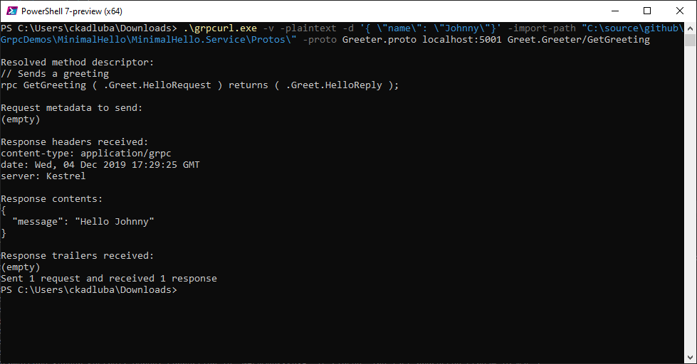
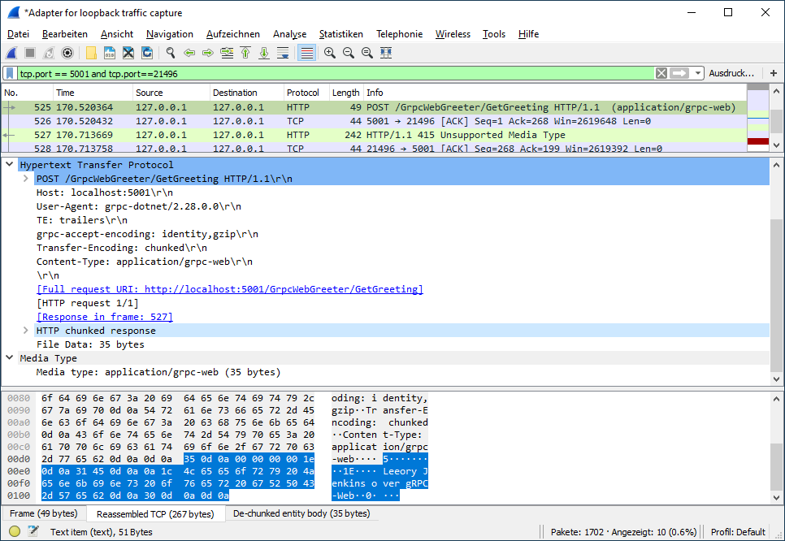

# gRPC Sample Programs

Here are some small sample apps written in C# to explore the current state and features of the gRPC stack for ASP.NET Core.

## MinimalHello

The simplest possible client and server gRPC sample app consisting of only two projects. It demonstrates also Microsoft Grpc.Net client- and server side logging.

## MinimalGoogleGrpc

Like MinimalHello but client and server based on Google's Grpc.Core library. For demo purposes, it uses insecure transport over HTTP/2 without TLS and demonstrates also Google Grpc.Core client- and server side logging.

## SimpleCalc

A simple calculator service with a client using synchronous gRPC calls with ASP .Net Core 3.0.  

Execute SimpleCalc.ServiceHost and SimpleCalc.Client.

## LifeTime

Two services called from one client. One is configured to create the service class for each request (default) and the other has one single service class instance for all requests.  

Execute LifeTime.ServiceHostPerCall, LifeTime.ServiceHostSingleton, LifeTime.ServiceHostGoogleGrpc and LifeTime.Client.

## ServerReflection

Demonstrates gRPC Server Reflection. Sample contains only service project.  

Call server reflection via gRPCurl in call-service.ps1.

## Metadata

Demonstrates sending call metadata in request and response between client and server.

## Deadline

Demonstrates terminating a gRPC call using deadline.

## AsyncEcho

A service that just echos the input from the client using an asynchronous gRPC call.

Execute AsyncEcho.ServiceHost and AsyncEcho.Client.

## AsyncChat

A small chat server with a console client using only one asynchronous gRPC call with bidirectional streaming.

Execute AsyncChat.ServiceHost and two or more instances of AsyncChat.Client.

## GrpcWeb

Uses gRPC-Web to perform gRPC communication over HTTP/1.1.

# Writing the Code

This example is based on the SimpleCalc sample app.

1. Maybe you need to install dotnet-grpc  
   ```
   dotnet tool install -g dotnet-grpc
   ```

1. Create SimpleCalc.SharedLib as netcoreapp3.0 classlib  
   netstandard2.x would be desirable but does not work because of tooling issue 
   https://github.com/aspnet/AspNetCore.Docs/issues/14702

2. Create service contract  
   In SharedLib create SimpleCalc.proto  

3. Generate client and server stubs  
   In SharedLib: Add > Service Reference > gRPC > File: .proto file, Type: Client and Server  
   Can also be done with CLI:
   ```powershell
   dotnet grpc add-file [options] <files>...
   ```

4. Edit Protobuf element to make generated source visible in Solution Explorer (optional)
   ```xml
   <Protobuf Include="calculator.proto"
             OutputDir="%(RelativePath)"
             CompileOutputs="false" />
   ```
   Attention: don't change back or you get errors in clients (duplicated definitions).

5. Create SimpleCalc.ServiceLib as netcoreapp3.0 classlib.  
   Add project reference to SharedLib.  
   Add class CalculatorService deriving from CalculatorServiceBase.  
   Implement service methods.

6. Create SimpleCalc.ServiceHost by Add > New Project > "gRPC Service" template  
   Delete unused generated directories Services and Proto  
   Add project reference to ServiceLib.  

7. Create SimpleCalc.Client as console app  
   Add reference to SharedLib.  
   Install NuGet package Grpc.Core for Google Grpc library if using that instead of Microsoft Grpc
   Create instance of CalculatorServiceClient and use with GrpcChannel.ForAddress()

# gRPC and WCF

## Existing Libraries

* WCF is a Microsoft .Net technology
  * will not come to .NET Core/.NET 5
* Original gRPC from Google
  * Grpc.Core etc.
  * Managed wrapper which calls native lib written in C
* Microsoft gRPC
  * 100% managed code
  * Grpc.Net, Grpc.AspNetCore, etc.

## Binding and Contracts

* WCF Endpoint
  * address
  * binding (protocol, security, etc. also custom bindings possible)
  * contract (interface with ServiceContract attribute)
    * Implemented by class on server
    * Implemented by generated class on client (Add Service Reference ...)
* gRPC
  * transport over HTTP/2 (for all .Net implementations)
  * channel - single virtual connection (multiplexing, pooling, load balancing, one or more physical connections)
  * IDL interface definition language is protobuffers (.proto)
  * Generated code stubs (client and server code that accesses channel, generated from IDL using protoc compiler)
    * Server stub is base class to derive from (Add Service Reference - Server)
    * Client stub (Add Service Reference - Client)

## Transfer Modes


| WCF          | gRPC          | Comment     | Protobuffers Sample        |
|--------------|---------------|-------------|----------------------------|
| Buffered     | Unary         | Client sends single request, server answers with respose | rpc Hello (Request) returns (Reply) |
| Return stream to client with binding that supports streamed transfer mode | Server streaming| Service sends stream to the client | rpc DownloadFile (Request) returns (stream Reply) |
| Pass stream to server with binding that supports streamed transfer mode | Client streaming | Client sends stream to the server | rpc UploadFile (stream Request) returns (Response) | 
| 🤷‍😂          | Bidirectional streaming | Client and server using streams | rpc JoinVideoConference (stream Request) returns (stream Response) |

## Service Lifetime

* When is the service class created/reused?
* In WCF controlled by ServiceBehaviorAttribute on service contract (e.g. InstanceContextMode.PerSession)
* In Google Grpc.Core based services a single instance all requests.
* In Microsoft Grpc.AspNetCore based services a new instance for each request
  * Can be controlled by directly registering the service with AddSingleton()
    ```csharp
    public void ConfigureServices(IServiceCollection services)
    {
        services.AddGrpc();
        services.AddSingleton(new GreeterService());
    }
    ```

## Security

* WCF supports HTTPS/TLS transport
* gRPC
  * All implementations support HTTP/2 with TLS
    * not required
    * still problems in practice with some tools and implementations (see Tools section below)
  * gRPC also supports Google token based authentication  
    https://grpc.io/docs/guides/auth/
  * Extensible for futher authentication mechanisms

## ServerCallContext

* gRPC passes ServerCallContext instance to every service method
  * Call specific technical information and functions
  * Exchange metadata (both directions)
  * Deadline/timeout for call
  * Authentication info
  * Called host, method and calling client info
  * Set response status
  * Set Stream options
  * etc.
* WCF service methods can use OperationContext.Current

## gRPC Server Reflection

Client can query service interface.

* WCF - Metadata Exchange Protocol (MEX)
* gRPC - Server Reflection
  * NuGet Grpc.AspNetCore.Server.Reflection
  * Server code  
    Add Grpc Reflection  
    ```csharp
    public void ConfigureServices(IServiceCollection services)
    {
        services.AddGrpc();
        services.AddGrpcReflection();
    }
    ```  
    Map Grpc Reflection service  
    ```csharp
    app.UseEndpoints(endpoints =>
    {
        endpoints.MapGrpcService<GreeterService>();
        endpoints.MapGrpcReflectionService();
    });
    ```

## Deadlines/Timeouts

* In WCF controlled by Binding
  * OpenTimeout, CloseTimeout, SendTimeout, ReceiveTimeout
  * Enforced on client side
* In gRPC every call can have an individual deadline/timeout
  * Some libraries use a fixed point in time (deadline) others a maximum delay (timeout)
  * Enforced by library
  * Handling in gRPC ASP.NET
    * Client gets RpcException with StatusCode=DeadlineExceeded
    * Server can use CancellactionToken in ServerCallContext object

# Logging

## Google gRPC based Implementations
* Code (Client and Server)
  ```csharp
  Environment.SetEnvironmentVariable("GRPC_TRACE", "all");
  Environment.SetEnvironmentVariable("GRPC_VERBOSITY", "debug");
  Grpc.Core.GrpcEnvironment.SetLogger(new Grpc.Core.Logging.ConsoleLogger());
  ```
* https://stackoverflow.com/questions/51440399/c-sharp-grpc-client-name-resolution-failure

## Microsoft Grpc.Net based Implementations  
* https://docs.microsoft.com/en-us/aspnet/core/grpc/diagnostics?view=aspnetcore-3.1
* Server config
  ```json
  {
    "Logging": {
      "LogLevel": {
        "Default": "Debug",
        "System": "Debug",
        "Microsoft": "Debug",
        "Grpc": "Debug"
      }
    },
    "AllowedHosts": "*",
    "Kestrel": {
      "EndpointDefaults": {
        "Protocols": "Http2"
      }
    }
  }
  ```
* Server code
  ```csharp
  public static IHostBuilder CreateHostBuilder(string[] args) =>
      Host.CreateDefaultBuilder(args)
          .ConfigureLogging(logging =>
          {
              logging.AddFilter("Grpc", LogLevel.Debug);
          })
          .ConfigureWebHostDefaults(webBuilder =>
          {
             webBuilder.UseStartup<Startup>();
          });
  ```
* Client code
  ```csharp
  var loggerFactory = LoggerFactory.Create(logging =>
  {
      logging.AddConsole();
      logging.SetMinimumLevel(LogLevel.Debug);
  });
  using var channel = GrpcChannel.ForAddress("https://localhost:5001",
      new GrpcChannelOptions { LoggerFactory = loggerFactory });
  var client = new Greeter.GreeterClient(channel);
  ```

# Tools

* gRPCurl - a curl for gRPC
  * https://github.com/fullstorydev/grpcurl
  * Command line tool. Many features but not easy to use.
  * Example: call MinimalHello.Service with unencrypted HTTP/2 
    ```powershell
    grpcurl -v -plaintext -d '{ \"name\": \"Johnny\"}' -import-path "C:\source\github\GrpcDemos\MinimalHello\MinimalHello.Service\Protos\" -proto Greeter.proto localhost:5001 Greet.Greeter/GetGreeting
    ```   
    
  * Did not work with TLS 😢
* BloomRPC - a Postman like test tool for gRPC
  * https://github.com/uw-labs/bloomrpc
  * Enter only host[:port] in address field, not full URI like "https://...". Uri is generated according to TLS setting.
  * Could add ASP.Net Core dev certificate as .crt but unfortunately could not get to work with TLS 😢 because of https://github.com/uw-labs/bloomrpc/issues/100 
* gRPCox - Web based gRPC test tool running in a Docker container  
  * https://github.com/gusaul/grpcox 
  * Requires server to support gRPC reflection 😢
* Postman + grpc-json-proxy
  * https://github.com/jnewmano/grpc-json-proxy and https://medium.com/@jnewmano/grpc-postman-173b62a64341
  * Project seems to be dead on GitHub 😢
  * TLS not supported 😢
* Wireshark
  * Only suitable for general connectivity problems or with insecure HTTP/2 during development
  * TLS also possible but requires cumbersome server cert + private key setup in Wireshark
  * Trace packets on loopback interface with display filter "tcp.port == 5001"
  * Configure HTTP/2 dissection if not port 80: Edit > Settings > Protocols > http2 > Port = 5001
* gRPC-Web
  * https://github.com/grpc/grpc/blob/master/doc/PROTOCOL-WEB.md
  * Compatibility extension for clients and server envs that cannot handle HTTP/2
  * Can use HTTP/1.1 instead of HTTP/2 to transport gRPC communication
  * Supported in ASP.NET Core (https://devblogs.microsoft.com/aspnet/grpc-web-experiment/)
  * Can be used to connect SPA browser apps that cannot send HTTP/2 requests yet (browser API restrictions).
  * Has restrictions compared to HTTP/2 transport (no client or bidirectional streaming)
  * Wireshark sample:
    
* Traffic Parrot
  * https://trafficparrot.com/tutorials/mocking-and-simulating-grpc.html
  * Wire mocking gRPC services
  * Commercial license, 14-day trial.

# References and Documentation

* Official gRPC site and GitHub repo  
  https://grpc.io/  
  https://github.com/grpc/grpc
* gRPC ASP.NET Core  
  https://github.com/grpc/grpc-dotnet
* A curated list of useful gRPC resources  
  https://github.com/grpc-ecosystem/awesome-grpc
* Code Magazine - gRPC as a Replacement for WCF  
  https://www.codemag.com/article/1911102
* Microsoft ASP.NET Core gRPC docs  
  https://docs.microsoft.com/en-us/aspnet/core/grpc/migration?view=aspnetcore-3.1  
  https://docs.microsoft.com/en-us/aspnet/core/grpc/configuration?view=aspnetcore-3.1
* Grpc.Net client "stream removed" problem  
  https://stackoverflow.com/questions/55747287/unable-to-make-a-connection-between-trivial-c-sharp-grpc-client-and-server?noredirect=1
* gRPC wire format  
  https://github.com/grpc/grpc/blob/master/doc/PROTOCOL-HTTP2.md
* ASP.NET Core gRPC not yet supported on IIS/Azure App Service but possible as generic hosted service with Kestrel on AKS.  
  https://github.com/aspnet/AspNetCore/issues/9020